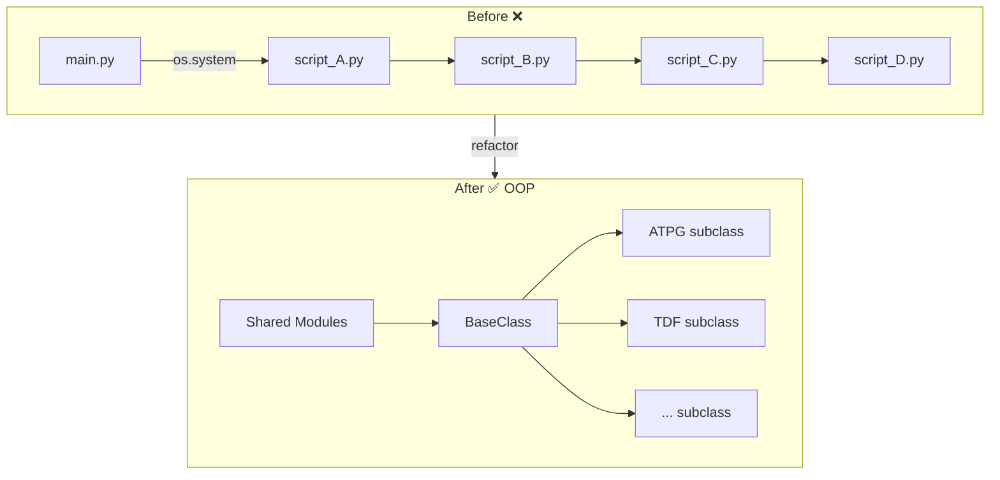

# Roku HM Screen｜BQ 準備筆記
> 面試關卡：Hiring Manager Screen (Zoom 45~60min)
> 參考：RoyYu_Experience.md 的 10 個 STAR 案例

---

## 自我介紹

### 骨架（倒敘法，中文版）

**① 現在** → Qualcomm，Silicon test，AI 自動化工具

**② 上一份** → Zealogics（2024-2025）：光學顯微鏡 UI 系統，TestComplete，Bamboo CI pipeline

**③ 主要經歷** → AIROHA（2020-2024）：GNSS 晶片軟體測試，用 Python 建立自動化框架，負責完整測試流程從規劃到產出 MP Report

**④ 核心** → 自動化工具 + embedded 系統測試

**⑤ Why Roku** → device testing + 自動化 + 持續品質改善，跟我的方向契合

> 不要背，記骨架，用自己的話說

---

### 英文版（Panel 用）

> I'm currently a Digital SoC Test Engineer at Qualcomm, where I build AI-assisted automation tools to streamline test program generation during silicon bring-up.
>
> Before that, I spent several years in software QA roles — at AIROHA, testing GNSS chips and building Python-based automation frameworks for power measurement and regression testing; and at Zealogics, doing software QA on an optical microscope UI system with CI/CD pipeline integration using Bamboo and TestComplete.
>
> Overall, my background centers around two things: building automation tools that improve team efficiency, and testing hardware-dependent systems. That's why this role at Roku stands out to me — it brings together embedded device testing and automation in a way that directly fits my experience.

---

## BQ 題型對應 STAR

| BQ 題型 | 最適合的 STAR |
|---------|-------------|
| Challenge | [STAR #2（韓國）](#star2)、[STAR #4（晶片認證）](#star4) |
| Disagreement | [STAR #5（RD 意見分歧）](#star5)、[STAR #6（說服主管）](#star6) |
| Initiative / 主動 | [STAR #1（Power 自動化）](#star1)、[STAR #3（ATE 數據自動分析）](#star3)、[STAR #9（測試分類標準）](#star9) |
| Learning / Failure | [STAR #7（外測失誤）](#star7) |
| Collaboration | [STAR #8（帶領 AE）](#star8) |
| Ambiguous / 不確定 | [STAR #10（Apple Watch 競品）](#star10) |
| Hardest part | [STAR #2（韓國）主軸](#star2)，[STAR #4 備用](#star4) |
| AI-assisted / Code quality | [STAR #11（Qualcomm TP Generation）](#star11) |

---

## 常見 BQ 題目

### Q：Tell me about yourself
→ 用自介骨架回答，約 40~50 秒

---

### Q：Why Roku?

Roku 這個職位吸引我的原因很直接：JD 上的核心要求跟我的背景高度重疊。

我喜歡寫 Python、有 QA 的硬實力背景、又在 embedded 系統上做過完整的測試週期——從規劃架構性的測試項目，到用 Python 實作自動化，這些剛好都是這個職位需要的。

Roku 本身是消費性裝置，軟體和系統行為直接影響到使用者體驗，這跟我在 AIROHA 做客戶導向測試、現場支援客戶的思維是一致的——測試的目的不只是找 bug，而是確保產品到了使用者手上是可靠的。

當然我也注意到有些地方還有距離，例如 pytest、BDD、Jenkins——但這些反而是我主動在補的方向。我自己有個 repo 在練習 pytest，包含 fixture、mock、GitHub Actions CI。

所以 Roku 對我來說是一個可以把現有實力完整發揮、同時繼續成長的地方，這是我最想加入的原因。

> 說這題要有自信，重點是：gap 存在，但你已經在主動補，而且是出於真實興趣

---

### Q：Tell me about a time you faced a challenge
**→ STAR #2（韓國現場支援）**

**S：** 2024 年，公司爭取韓國客戶訂單，SW 版本即將 lock，我被派駐現場。大量 road test 數據接連進來，需要快速分析並跟競品對標，沒有現成工具，時間壓力極大。

**T：** 第一手分析客戶的 road test 數據，找出定位軌跡與 TTFF 差於競品的根本原因，快速整理出有效資訊給 RD 優化。

**A：**
- 跟台灣同事合作開發分析工具，用 Python 自動化數據處理
- 建立分析 SOP，讓每次 road test 的結果可以快速對比
- 建立 QA 與 RD 的共享平台，加速資訊流通
- 系統性找出問題根因（收星數量、訊號強度、inject 順序），整理分類後帶著數據找 RD 討論

**R：** 客戶如期 lock 版本；RD 針對橋下場景補強 dead reckoning、TTFF 調整資料 inject 順序；主管肯定我在現場的判斷和處理方式；QA 在客戶支援流程中的角色被正式確立。

---

### Q：Tell me about a time you disagreed with someone
**→ STAR #5（Issue Tracking 與 RD 意見分歧）**

**S：** 在 AIROHA，每季發版後我會透過 JIRA 通知 RD 修正問題，但 RD 常對我提出的 issue 提出不同看法，有時甚至認為測試手法本身有問題。

**T：** 在維護 QA 測試標準的同時，也要讓 RD 信服、確保 issue 能被有效追蹤和修正。

**A：**
- 嚴重且明確的問題直接要求修正，不讓步
- 有灰色地帶的問題：整合對方的意見，調整測試方法、產出實驗數據
- 將雙方討論整理成提案，在正式會議上討論，建立雙方都能遵循的標準並文件化

**R：** 留存的文件成為內部測試準則，也可以作為跟客戶溝通的說明文件；跟 RD 之間建立了更有結構的溝通模式。

> 這題重點是：有 backbone，但不是硬碰硬，而是用數據說話、找共識

---

### Q：Tell me about a time you took initiative
**→ STAR #1（Power 量測自動化）**

**S：** 2023 年新品上市，市場主打低功耗，需要大量 power 測試數據。當時全部手動量測，一輪跑完要一週。

**T：** 在 deadline 內產出不同版本、不同場景的 power 數據與分析報告。

**A：**
- 主動評估自動化可行性，做提案報告爭取資源
- 分階段建構自動化：儀器控制層 → 裝置監測層 → 結果分析層
- 加上 UI 介面讓 AE 可以自行選擇版本和場景跑測試，不需要改程式碼
- 每週回報進度

**R：** 量測時間從一週縮短至三天（效率提升 130%）；降低人為誤差；AE 可以獨立執行，晚上和週末可以無人值守跑測試。

> 備用：STAR #9（主動定義測試分類標準）— 適合問「主動改善流程」類型的題目

---

### Q：Tell me about a time you failed / learned from a mistake
**→ STAR #7（外測版本錯誤）**

**S：** 剛加入 AIROHA，第一個任務就是外測。對產品不夠熟悉，測試前沒有確認 SW 版本，導致用了錯誤版本跑測試，錯誤數據混入報告並在會議上呈現。

**T：** 在錯誤發生後，快速補救，並確保同樣問題不再發生。

**A：**
- 會議後立刻查出錯誤原因
- 用正確版本重測，整理正確結果
- 寄道歉信通知相關人員，在下次會議補充說明
- 將這個失誤整理成外測前置 SOP，標準化版本確認流程

**R：** 團隊接受處理方式；此後外測前置流程更嚴謹；也影響了日後我撰寫測試項目時更仔細標註前置條件。

> 這題重點是：出了事不逃避，快速補救 + 系統化預防，讓同樣的錯誤不再發生

---

### Q：What's the hardest part of your job?
→ 用 AIROHA 經歷回答（不用 Qualcomm，Silicon test 跟 Roku JD 關聯性低）

**框架：困難 + 怎麼克服 + 學到什麼**

- **困難**：第一次被派駐韓國客戶現場，版本即將 lock，大量 road test 數據需要快速分析，沒有現成工具，時間壓力極大
- **克服**：跟台灣同事合作開發分析工具、建立 SOP、建立 QA 與 RD 的共享平台加速資訊流通
- **學到**：QA 不只是找 bug，在關鍵時刻能快速建立分析能力、跟客戶需求直接對接，才是真正的價值所在

---

---

### Q：Tell me about a time you improved an existing system / ensured code quality / used AI-assisted development
**→ STAR #11｜Qualcomm AI-Assisted TP Generation**

> 適用：「describe a time you improved an existing system」、「how do you ensure code quality」、「have you used AI in your work」、「tell me about a complex technical problem you solved」

**口說版本（1~1.5 分鐘）：**
> 「我在 Qualcomm 負責一個 TP generation 的模組，原本是由 4 個耦合的 Python scripts 組成，用 os.system 串接，邏輯混雜、很難維護。我主動跟 AI 討論架構，提出用 OOP 重構的方案——建立 base class，讓不同的 block type 各自繼承並 override 差異化的部分，這樣新增一個 block type 只需要繼承，不用動到其他地方。同時我也負責撰寫 workflow 文件，讓 AI Agent 可以理解整個腳本的運作方式，使用者直接透過對話就能產出 TP component，不需要學複雜的 UI。最後 project lead 採用了新架構，反饋良好，也向主管爭取讓我回到這個專案。」

**完整 STAR：**

**S：** 現有的 TP generation 流程有兩個問題：
- **使用者端**：UI 介面複雜，component 多，learning curve 高
- **開發者端**：4 個 Python scripts 用 `os.system` 串接，無模組化，if-else 邏輯龐雜，難以維護和 debug

**T：** 主管交辦 refactor Fetch Data 流程；架構設計由我主動與 AI 討論並提出構想後實作。

**A：**
- 撰寫 workflow `.md` 文件，讓 AI Agent 理解現有腳本，使用者可透過對話產出 TP component，取代複雜 UI
- Refactor：將 4 支獨立腳本模組化，建立 base class，針對不同 block type（ATPG、TDF 等）繼承子 class 並 override 差異化 method
- 以 OOP 架構取代 `os.system` 呼叫，提升可維護性與擴充性

**R：**
- Project lead 採用新架構進行後續開發和 debug，反饋良好，並向主管爭取讓我回到該專案
- 建立 29 個 unit tests 全數通過；regression tests 同時執行 v1 和 v2 逐欄比對輸出，確保重構前後結果一致

### 架構對比圖

> **重點**：這題說明你有主動思考架構的能力，不只是執行交辦任務；同時展示 AI-assisted 開發的實際經驗

---

---

## 備用 STAR 案例

### STAR #3｜ATE 數據自動分析｜Achievement
> 適用：「主動改善流程」、「automation initiative」、「reduce human error」

**S：** 2021 年接手 ATE Spec Features 維護，發現結果分析部分仍為手動，需手動整理 KPI 並填表，容易出錯且耗時。

**T：** 標準化並自動化分析、計算、填表流程，加快報告產出速度。

**A：**
- 拆解手動步驟，找出可自動化的環節
- 設計 Python 腳本自動讀取數據、計算 KPI、填入報表
- 完成後建立 SOP，讓同事快速上手

**R：** 報告產出時間從一週縮短至一天；降低人為填表錯誤；SOP 讓其他人可以獨立操作。

---

### STAR #4｜爭取 GNSS 晶片認證｜Challenge
> 適用：「面對不熟悉的挑戰」、「learn something new」、「work under ambiguity」

**S：** 2023 年公司要打入中國市場與車用市場，需要 QA 先做 pre-check，確認晶片能通過第三方認證。當時沒有內部經驗可以參考。

**T：** 研讀認證規範，模擬測試情境，找出不符合項目反饋 RD 優化，降低正式認證的失敗風險。

**A：**
- 逐項對比認證規範與內部 spec，找出 gap
- 設計模擬測試情境並執行，整理結果
- 協助 RD 迭代修正直到 pre-check 通過
- 更新內部 SOP 留存

**R：** 正式認證測試大部分一次通過；pre-check 模擬結果加速問題收斂、降低認證成本。

---

### STAR #6｜說服主管採購新功率計｜Disagreement
> 適用：「disagree with manager」、「insist on quality」、「data-driven decision」

**S：** 在 AIROHA 做 power 量測時，只能借用舊設備，導致數據不一致、可信度低。提出採購申請但主管認為理由不充分。

**T：** 用數據說服主管，建立 QA power 量測的公信力。

**A：**
- 借來四台不同功率計，在五個場景下同步量測並比較差異，用數據量化設備誤差
- 調查市場最低成本方案
- 整理完整的採購申請報告，附上數據佐證

**R：** 成功說服主管採購；新設備整合進自動化腳本；在下一版本發布前提供可靠數據給客戶。

> 重點：不是靠口頭說服，而是用實驗數據讓對方沒辦法反駁

---

### STAR #8｜季版任務管理與帶領 AE｜Collaboration
> 適用：「team collaboration」、「how do you manage/prioritize work」、「leadership」

**S：** AIROHA 每季發版，Leader 分配 features 給 QA，我負責帶領 2 名 AE 在期限內完成測試執行與 issue tracking。

**T：** 在規劃時程內完成 new/legacy features 的測試執行與 issue 追蹤，準時產出 MP Report。

**A：**
- 用甘特圖規劃進度與資源分配，按測試類別分工給 AE
- issue 確認後要求 AE 開 JIRA 票，由自己統一追蹤進度
- 彙整所有結果產出 MP Report

**R：** 主管肯定甘特圖的資源呈現方式；AE 有效執行、準時產出正確結果。

---

### STAR #9｜主動定義測試分類標準｜Proactive
> 適用：「proactive / initiative」、「improve team process」、「knowledge sharing」

**S：** 在 Zealogics，團隊被要求撰寫全面的測試項目，但內部對測試類別沒有明確定義，大家設計時各有各的標準，沒有共同準則。

**T：** 設計測試項目時盡量涵蓋各面向，同時幫助團隊建立共同標準。

**A：**
- 憑藉在 AIROHA 的經驗，加入時就已主動對測試項目分類（Functional / Performance / Stress / Integration）
- 主管在會議上提到這個問題時，主動分享概念並承擔整理定義的任務
- 製作測試類別定義表，分享給全團隊

**R：** 內部有共同準則可依循；也提供了跟客戶溝通時的說明平台。

---

### STAR #10｜競品 Apple Watch 競爭分析｜Ambiguous
> 適用：「work under ambiguity」、「bias for action」、「deal with constraints」

**S：** 2024 年初，Apple Watch S9 搭載競品 GNSS 晶片，同事在中國借到競品設備但無法帶出境。主管希望 QA 遠端進行競品分析，但沒有明確的測試方法可以參考。

**T：** 在無法直接接觸競品設備的情況下，分析競品定位策略，找出優劣並提供 RD 改進方向。

**A：**
- 事先整理測試項目，與 RD 討論設計適合遠端執行的測試情境
- 遠端花兩天設置測試環境，利用假日執行測試
- 根據競品表現持續調整測試情境，確保比較結果有效
- 產出完整的競品比較報告

**R：** 測試項目成為日後競品 benchmark 的標準流程；分析結果提供 RD 軟體策略優化方向。

> 重點：限制條件下不等待，主動找出可行的方法

---

## 變化球題目

> 這些屬於 Technical 變化球，詳細回答框架請見 [HM_Screen_Prep_Note.md — 變化球題目](HM_Screen_Prep_Note.md)
