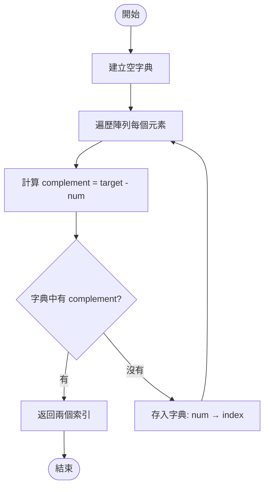
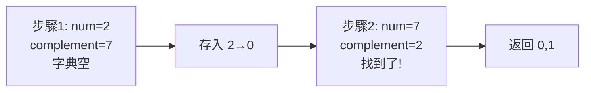
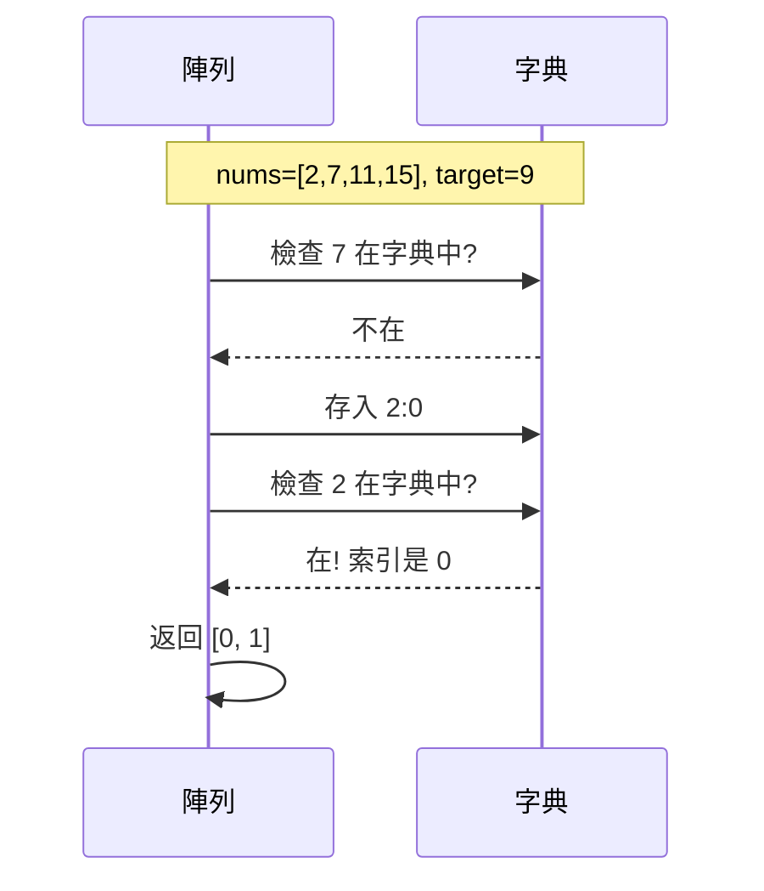
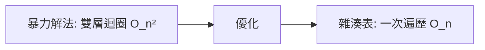

# 1. Two Sum (兩數之和)

## 題目描述

給定一個整數陣列 `nums` 和一個目標值 `target`，請找出陣列中兩個數字，使得它們的和等於目標值，並返回這兩個數字的索引。

**條件：**
- 每個輸入保證只有一組解
- 不能使用同一個元素兩次
- 可以以任意順序返回答案

**範例：**

```python
輸入: nums = [2,7,11,15], target = 9
輸出: [0,1]
解釋: nums[0] + nums[1] = 2 + 7 = 9

輸入: nums = [3,2,4], target = 6
輸出: [1,2]

輸入: nums = [3,3], target = 6
輸出: [0,1]
```

## 解法思路

### 方法：雜湊表（Hash Map）✅

## 演算法流程圖



## 圖解執行過程

以 `nums = [2, 7, 11, 15], target = 9` 為例：



**詳細步驟：**

| 步驟 | 當前數字 | complement | 字典狀態 | 動作 |
|------|---------|------------|---------|------|
| 1 | nums[0]=2 | 9-2=7 | {} | 7 不在字典，存入 {2:0} |
| 2 | nums[1]=7 | 9-7=2 | {2:0} | 2 在字典中！返回 [0,1] |

## 演算法互動圖



## 核心思路

**一句話總結：** 用字典記錄「已看過的數字」，每次檢查「需要的配對數字」是否已經出現過。

**關鍵概念：**

1. **配對數字（complement）**
   ```
   如果 a + b = target
   那麼 b = target - a
   ```

2. **空間換時間**
   - 使用字典（O(n) 空間）
   - 換取 O(1) 的查找速度
   - 總時間從 O(n²) 降到 O(n)

3. **邊遍歷邊查找**
   - 不需要先建完整個字典
   - 遍歷時同時查找和存儲
   - 保證不會用同一個元素兩次

## 實現代碼

```python
from typing import List

class Solution:
    def twoSum(self, nums: List[int], target: int) -> List[int]:
        # 字典：存儲 {數字: 索引}
        num_map = {}

        # 遍歷陣列
        for i, num in enumerate(nums):
            # 計算需要的配對數字
            complement = target - num

            # 如果配對數字已經在字典中，返回兩個索引
            if complement in num_map:
                return [num_map[complement], i]

            # 將當前數字和索引存入字典
            num_map[num] = i

        # 題目保證有解，不會執行到這裡
        return []
```

## 複雜度分析

| 項目 | 複雜度 | 說明 |
|-----|--------|------|
| **時間複雜度** | O(n) | 只需遍歷陣列一次，字典操作都是 O(1) |
| **空間複雜度** | O(n) | 最壞情況需要存儲 n-1 個元素到字典 |

**優化對比：**



## 重點提醒

1. **為什麼要用字典？**
   - 陣列查找：O(n)
   - 字典查找：O(1) ✓

2. **為什麼不會重複使用同一個元素？**
   ```
   先檢查 complement in num_map（此時 num 還沒加入）
   再執行 num_map[num] = i（之後才加入）
   → 當前元素不會與自己配對
   ```

3. **為什麼一定找得到答案？**
   ```
   假設答案是索引 [a, b]，其中 a < b
   當遍歷到索引 b 時：
   - nums[a] 已經在字典中
   - complement = target - nums[b] = nums[a]
   - 必定能找到！
   ```

## 相關題目

- [15. 3Sum](https://leetcode.com/problems/3sum/) - 進階：找三個數
- [167. Two Sum II](https://leetcode.com/problems/two-sum-ii-input-array-is-sorted/) - 變形：已排序陣列
- [170. Two Sum III](https://leetcode.com/problems/two-sum-iii-data-structure-design/) - 設計資料結構

---

**難度：** Easy
**標籤：** Array, Hash Table
**解法：** Hash Map (一次遍歷)
