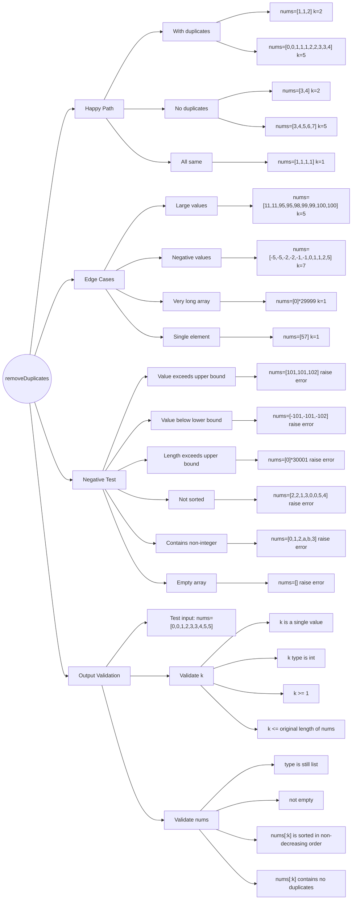

# Problem

- Title: Remove Duplicates from Sorted Array
- Link: https://leetcode.com/problems/remove-duplicates-from-sorted-array/
- Difficulty: easy

# Constraints

- `1 <= nums.length <= 3 * 10^4`
- `-100 <= nums[i] <= 100`
- `nums` is sorted in non-decreasing order

# Approach

- Key idea:
- Data structures:
- Edge cases:

# Complexity

- Time:
- Space:

# Test Plan

# Notes

- Any pitfalls or alternative approaches.
- Negative Test cases assume input validation is not yet implemented in solution. Tests are expected to fail until validation is added.
