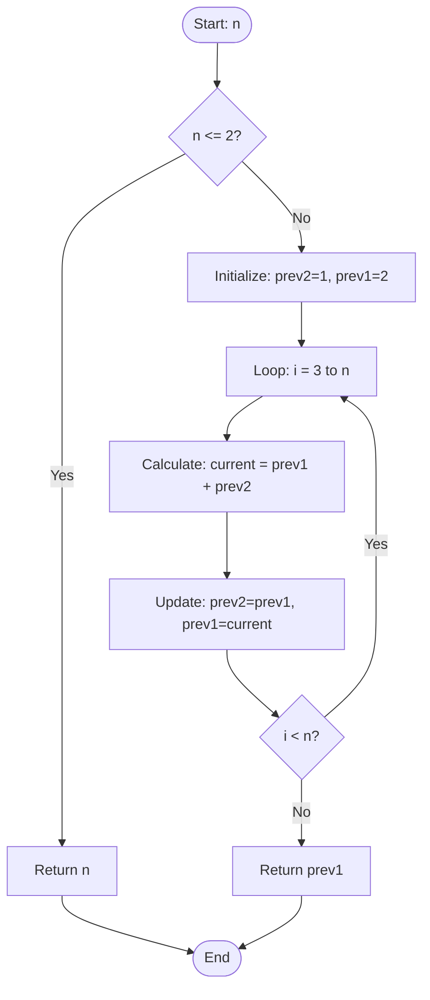
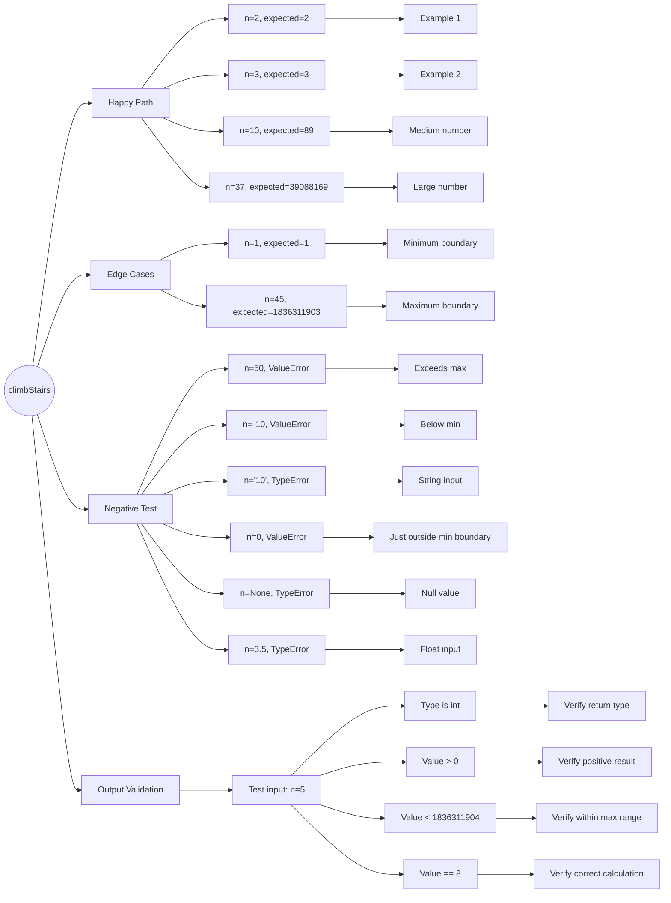

# 70. Climbing Stairs

## Problem Description

You are climbing a staircase. It takes `n` steps to reach the top.

Each time you can either climb `1` or `2` steps. In how many distinct ways can you climb to the top?

**Constraints:**
- `1 <= n <= 45`

**Examples:**

```
Input: n = 2
Output: 2
Explanation: There are two ways to climb to the top.
  1. 1 step + 1 step
  2. 2 steps

Input: n = 3
Output: 3
Explanation: There are three ways to climb to the top.
  1. 1 step + 1 step + 1 step
  2. 1 step + 2 steps
  3. 2 steps + 1 step
```

## Approach

### Method: Dynamic Programming (Space-Optimized)

**Key idea:** This is essentially a Fibonacci sequence. To reach step n, you can only come from step n-1 or n-2, so `f(n) = f(n-1) + f(n-2)`. Use two variables to track previous states for O(1) space.

## Algorithm Flowchart



## Step-by-Step Walkthrough

### DP 5-Step Framework

1. **State Definition**: `dp[i]` = number of ways to reach step i
2. **Recurrence Relation**: `dp[i] = dp[i-1] + dp[i-2]`
3. **Base Cases**: `dp[1] = 1`, `dp[2] = 2`
4. **Computation Order**: Bottom-up from 1 to n
5. **Final Answer**: `dp[n]`

### Example (n=5)

| Step i | Ways | Calculation |
|--------|------|-------------|
| 1 | 1 | base case |
| 2 | 2 | base case |
| 3 | 3 | 2 + 1 |
| 4 | 5 | 3 + 2 |
| 5 | 8 | 5 + 3 |

### Space Optimization

**Initial idea**: Sliding window with `pop(0)`
- Space: O(1) ✅ but Time: O(n²) ❌ (`pop(0)` is O(n))

**Final solution**: Two variables
- Space: O(1) ✅ and Time: O(n) ✅

## Implementation

```python
class Solution:
    def climbStairs(self, n: int) -> int:
        if n <= 2:
            return n
        
        prev2, prev1 = 1, 2
        for i in range(3, n + 1):
            prev2, prev1 = prev1, prev1 + prev2
        
        return prev1
```

## Complexity Analysis

| | Complexity | Explanation |
|-|------------|-------------|
| **Time** | O(n) | Loop runs n-2 times with O(1) operations |
| **Space** | O(1) | Only two variables used |

## Notes

### Key Insights
- Pattern recognition: This is Fibonacci sequence
- Space optimization: Only need last 2 states, not entire array
- Avoid `list.pop(0)` - it's O(n). Use variables or `deque` instead

## Test Plan



## Related Problems

- [746. Min Cost Climbing Stairs](https://leetcode.com/problems/min-cost-climbing-stairs/) — Same structure with cost weights
- [509. Fibonacci Number](https://leetcode.com/problems/fibonacci-number/) — Similar recurrence relation
- [198. House Robber](https://leetcode.com/problems/house-robber/) — Similar DP pattern

---

**Difficulty:** Easy
**Tags:** Math, Dynamic Programming, Memoization
