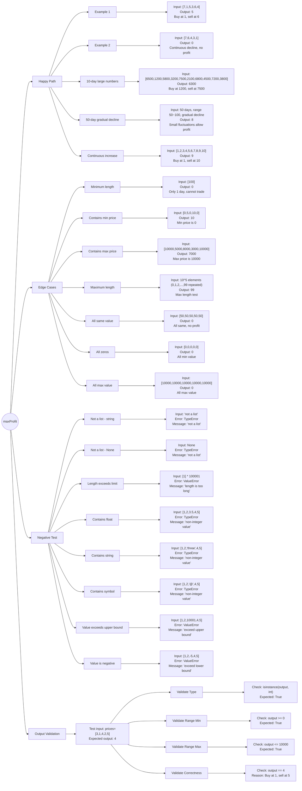

# Problem

- Title: Best Time to Buy and Sell Stock
- Link: https://leetcode.com/problems/best-time-to-buy-and-sell-stock/
- Difficulty: easy

## Description

You are given an array `prices` where `prices[i]` is the price of a given stock on the `i`th day.

You want to maximize your profit by choosing a single day to buy one stock and choosing a different day in the future to sell that stock.

Return the maximum profit you can achieve from this transaction. If you cannot achieve any profit, return `0`.

## Examples

**Example 1:**
```
Input: prices = [7,1,5,3,6,4]
Output: 5
Explanation: Buy on day 2 (price = 1) and sell on day 5 (price = 6), profit = 6-1 = 5.
Note that buying on day 2 and selling on day 1 is not allowed because you must buy before you sell.
```

**Example 2:**
```
Input: prices = [7,6,4,3,1]
Output: 0
Explanation: In this case, no transactions are done and the max profit = 0.
```

## Constraints

- `1 <= prices.length <= 10^5`
- `0 <= prices[i] <= 10^4`

# Approach

## Method: Dynamic Programming (State Machine)

**Key idea:** Use two state arrays to track the maximum profit at each transaction stage:
- `s1[i]` = Maximum profit when holding stock after the i-th transaction
- `s2[i]` = Maximum profit after completing the i-th transaction

For each day, we update both states by considering whether to buy or sell.

## DP Framework

### 1. State Definition
- `s1[0]` = Max profit when holding stock (after buying)
- `s2[0]` = Max profit before any transaction (always 0)
- `s2[1]` = Max profit after completing 1 transaction (after selling)

### 2. State Transition
For each price on each day:
```python
s1[0] = max(s1[0], s2[0] - price)      # Buy: keep holding or buy today
s2[1] = max(s2[1], s1[0] + price)      # Sell: keep sold or sell today
```

### 3. Base Cases
- `s1[0] = -infinity` (haven't bought yet)
- `s2[0] = 0` (no transaction)
- `s2[1] = 0` (no profit yet)

### 4. Final Answer
Return `s2[1]` (max profit after 1 complete transaction)

## Algorithm Visualization

For `prices = [7,1,5,3,6,4]`:

| Day | Price | s1[0] (hold) | s2[1] (sold) | Action |
|-----|-------|--------------|--------------|--------|
| 0 | 7 | -7 | 0 | Buy at 7 |
| 1 | 1 | -1 | 0 | Buy at 1 (better) |
| 2 | 5 | -1 | 4 | Sell at 5 (profit=4) |
| 3 | 3 | -1 | 4 | No action |
| 4 | 6 | -1 | 5 | Sell at 6 (profit=5) |
| 5 | 4 | -1 | 5 | No action |

Final answer: 5

## Implementation

```python
def maxProfit(self, prices: list[int]) -> int:
    k = 1  # Can only buy and sell 1 time
    
    # State arrays
    s1 = [float('-inf')] * k  # Hold stock profit state
    s2 = [0] * (k + 1)         # Sell stock profit state
    
    for price in prices:
        for i in range(k):
            s1[i] = max(s2[i] - price, s1[i])      # Buy
            s2[i + 1] = max(s1[i] + price, s2[i + 1])  # Sell
    
    return s2[-1]
```

# Complexity

- **Time:** O(n) where n is the length of prices array. We iterate through prices once.
- **Space:** O(1) since k=1, the state arrays have constant size.

# Test Plan



# Notes

## Key Insights
- This solution uses a **generalized DP approach** that works for k transactions
- For k=1 (this problem), it simplifies to tracking two states: hold and sold
- The state transition ensures we always maintain the maximum profit at each stage

## Alternative Approaches

### 1. One-pass Tracking (Simpler for k=1)
```python
def maxProfit(self, prices: list[int]) -> int:
    min_price = float('inf')
    max_profit = 0
    
    for price in prices:
        min_price = min(min_price, price)
        max_profit = max(max_profit, price - min_price)
    
    return max_profit
```
- Time: O(n), Space: O(1)
- More intuitive: track minimum price seen so far and maximum profit

### 2. Simplified DP (Two Variables)
```python
def maxProfit(self, prices: list[int]) -> int:
    hold = float('-inf')
    sold = 0
    
    for price in prices:
        hold = max(hold, -price)
        sold = max(sold, hold + price)
    
    return sold
```
- Time: O(n), Space: O(1)
- Cleaner version of the state machine approach

## Comparison

| Approach | Pros | Cons |
|----------|------|------|
| State Array DP | Generalizable to k transactions | Slightly more complex for k=1 |
| One-pass Tracking | Most intuitive | Only works for k=1 |
| Two Variables DP | Clean and efficient | Less obvious generalization |

## Related Problems
- [122. Best Time to Buy and Sell Stock II](https://leetcode.com/problems/best-time-to-buy-and-sell-stock-ii/) - Multiple transactions allowed
- [123. Best Time to Buy and Sell Stock III](https://leetcode.com/problems/best-time-to-buy-and-sell-stock-iii/) - At most 2 transactions
- [188. Best Time to Buy and Sell Stock IV](https://leetcode.com/problems/best-time-to-buy-and-sell-stock-iv/) - At most k transactions
