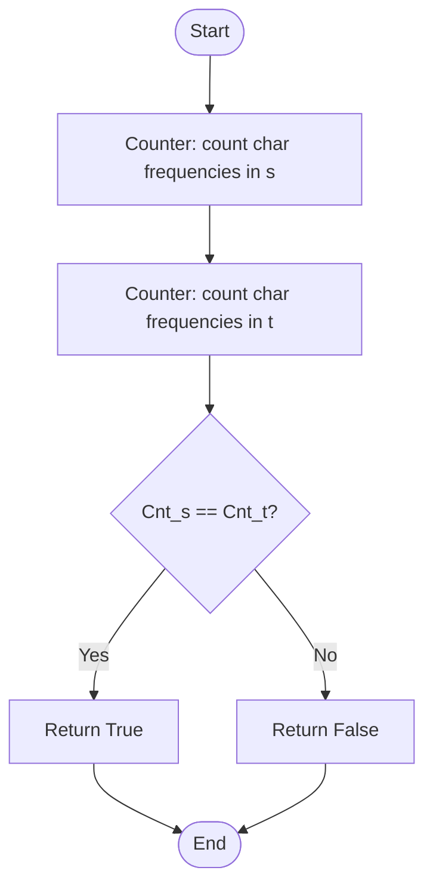
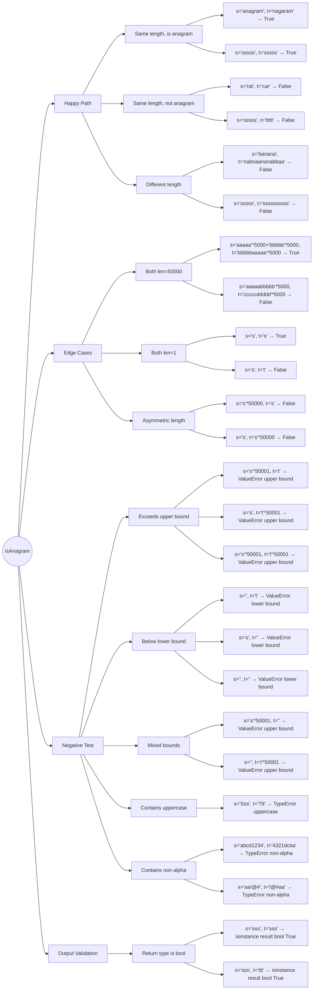

# 242. Valid Anagram

## Problem Description

Given two strings `s` and `t`, return `true` if `t` is an anagram of `s`, and `false` otherwise.

An **anagram** is a word formed by rearranging the letters of another word, using all the original letters exactly once.

**Constraints:**
- `1 <= s.length, t.length <= 5 * 10⁴`
- `s` and `t` consist of lowercase English letters only

**Examples:**

```
Input: s = "anagram", t = "nagaram"
Output: true
Explanation: "nagaram" is a rearrangement of all letters in "anagram"

Input: s = "rat", t = "car"
Output: false
Explanation: "rat" and "car" have different letter compositions
```

## Approach

### Method: Character Frequency Comparison (Counter / Hash Map) ✅

**Key idea:** An anagram has the exact same character frequencies as the original string.

Count the frequency of each character in both strings. If the frequency distributions are identical, `t` is an anagram of `s`.

## Algorithm Flowchart



## Step-by-Step Walkthrough

Using `s = "anagram"`, `t = "nagaram"`:

| Step | Operation | Result |
|------|-----------|--------|
| 1 | `Counter("anagram")` | `{'a': 3, 'n': 1, 'g': 1, 'r': 1, 'm': 1}` |
| 2 | `Counter("nagaram")` | `{'n': 1, 'a': 3, 'g': 1, 'r': 1, 'm': 1}` |
| 3 | Compare both Counters | Contents are equal → `True` ✅ |

Using `s = "rat"`, `t = "car"` (counter-example):

| Step | Operation | Result |
|------|-----------|--------|
| 1 | `Counter("rat")` | `{'r': 1, 'a': 1, 't': 1}` |
| 2 | `Counter("car")` | `{'c': 1, 'a': 1, 'r': 1}` |
| 3 | Compare both Counters | `'t'` vs `'c'` differ → `False` ❌ |

## Implementation

```python
from collections import Counter

class Solution:
    def isAnagram(self, s: str, t: str) -> bool:
        Cnt_s = Counter(s)
        Cnt_t = Counter(t)
        if Cnt_s == Cnt_t:
            return True
        else:
            return False
```

## Complexity Analysis

| | Complexity | Explanation |
|-|------------|-------------|
| **Time** | O(n) | Iterate through both strings once to build Counters |
| **Space** | O(1) | Counter holds at most 26 lowercase letters — constant size |

**Approach Comparison:**

| Approach | Time | Space | Notes |
|----------|------|-------|-------|
| Sort and compare | O(n log n) | O(n) | `sorted(s) == sorted(t)` |
| Counter comparison | O(n) | O(1) | This solution ✅ |
| Manual count array | O(n) | O(1) | Use a length-26 list to count |

## Notes

- **Why does Counter comparison work?**
  `Counter` is a subclass of `dict`. Comparing two Counters checks that every key-value pair is identical — any difference in character frequency returns `False`.

- **Common pitfall — `^` vs `**` in Python:**
  ```python
  5 * 10^4   # ❌ Bitwise XOR: 50 XOR 4 = 54
  5 * 10**4  # ✅ Exponentiation: 50000
  ```

- **`isupper()` behavior:**
  ```python
  "Hello".isupper()  # False — has lowercase letters
  "HELLO".isupper()  # True
  # For strict lowercase validation, prefer s.islower()
  ```

## Test Plan



## Related Problems

- [49. Group Anagrams](https://leetcode.com/problems/group-anagrams/) — Group all anagram strings together
- [438. Find All Anagrams in a String](https://leetcode.com/problems/find-all-anagrams-in-a-string/) — Find all anagram substrings
- [383. Ransom Note](https://leetcode.com/problems/ransom-note/) — Similar character frequency counting

---

**Difficulty:** Easy
**Tags:** Hash Table, String, Sorting
**Solution:** Counter Comparison (Hash Map)