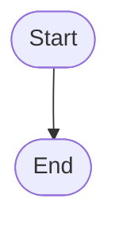
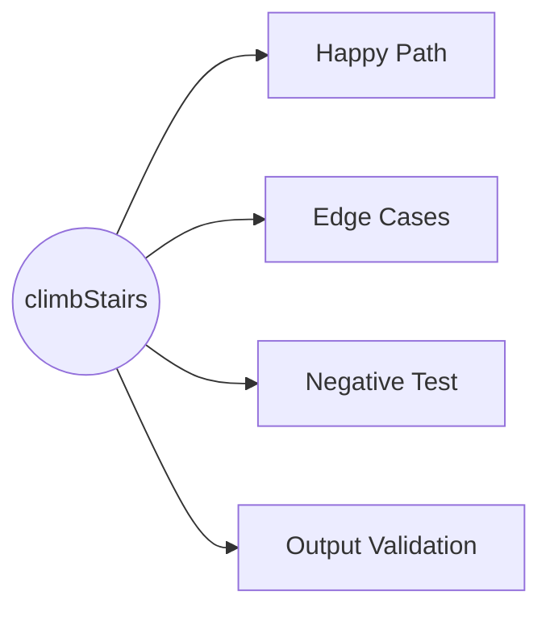

# 70. Climbing Stairs

## Problem Description

You are climbing a staircase. It takes `n` steps to reach the top.

Each time you can either climb `1` or `2` steps. In how many distinct ways can you climb to the top?

**Constraints:**
- `1 <= n <= 45`

**Examples:**

```
Input: n = 2
Output: 2
Explanation: There are two ways to climb to the top.
  1. 1 step + 1 step
  2. 2 steps

Input: n = 3
Output: 3
Explanation: There are three ways to climb to the top.
  1. 1 step + 1 step + 1 step
  2. 1 step + 2 steps
  3. 2 steps + 1 step
```

## Approach

### Method:

**Key idea:**

## Algorithm Flowchart



## Step-by-Step Walkthrough

## Implementation

```python
class Solution:
    def climbStairs(self, n: int) -> int:
        pass
```

## Complexity Analysis

| | Complexity | Explanation |
|-|------------|-------------|
| **Time** | O(?) | |
| **Space** | O(?) | |

## Notes

## Test Plan



*(Test Plan will be filled in after test case writing session)*

## Related Problems

- [746. Min Cost Climbing Stairs](https://leetcode.com/problems/min-cost-climbing-stairs/) — Same structure with cost weights
- [509. Fibonacci Number](https://leetcode.com/problems/fibonacci-number/) — Similar recurrence relation
- [198. House Robber](https://leetcode.com/problems/house-robber/) — Similar DP pattern

---

**Difficulty:** Easy
**Tags:** Math, Dynamic Programming, Memoization
